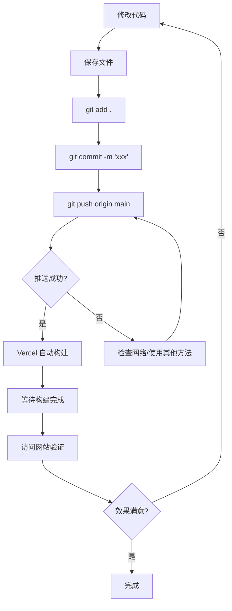

# 友链页面更新部署指南

## 📋 更新内容

本次更新添加了以下功能：

- ✅ 新增友链页面 (`/friends`)
- ✅ 支持显示好友头像图片
- ✅ 点击头像跳转到好友网站
- ✅ 显示网站名称和描述信息
- ✅ 精美的卡片式布局和悬停动画
- ✅ 响应式设计，支持深色模式
- ✅ 在导航栏添加友链入口
- ✅ 创建友链使用指南文档

## 🚀 部署步骤

### 当前状态

✅ 代码已提交到本地 Git 仓库
⏳ 等待推送到 GitHub
⏳ 等待 Vercel 自动部署

### 方法一：直接推送（推荐）

如果网络正常，执行：

```bash
cd "d:\下载\桌面\新建文件夹\my-blog"
git push origin main
```

### 方法二：使用 GitHub Desktop（如果命令行推送失败）

1. **下载并安装 GitHub Desktop**
   - 访问：https://desktop.github.com/
   - 下载并安装

2. **打开项目**
   - 启动 GitHub Desktop
   - File → Add Local Repository
   - 选择：`d:\下载\桌面\新建文件夹\my-blog`

3. **推送更改**
   - 在 GitHub Desktop 中会看到已提交的更改
   - 点击顶部的 "Push origin" 按钮
   - 等待推送完成

### 方法三：配置代理（如果有网络问题）

如果你有代理软件（如 Clash、V2Ray 等），配置 Git 代理：

```bash
# 查看你的代理端口（通常是 7890 或 10809）
# 然后执行：
git config --global http.proxy http://127.0.0.1:7890
git config --global https.proxy http://127.0.0.1:7890

# 推送代码
git push origin main

# 推送完成后可以取消代理
git config --global --unset http.proxy
git config --global --unset https.proxy
```

### 方法四：使用 SSH 协议

1. **检查是否有 SSH 密钥**
```bash
ls ~/.ssh
```

2. **如果没有，生成 SSH 密钥**
```bash
ssh-keygen -t rsa -b 4096 -C "1213722171@qq.com"
# 一路回车，使用默认设置
```

3. **复制公钥**
```bash
cat ~/.ssh/id_rsa.pub
# 复制输出的内容
```

4. **添加到 GitHub**
   - 访问：https://github.com/settings/keys
   - 点击 "New SSH key"
   - 粘贴公钥内容
   - 点击 "Add SSH key"

5. **修改远程仓库地址**
```bash
cd "d:\下载\桌面\新建文件夹\my-blog"
git remote set-url origin git@github.com:1213722170/blog.git
git push origin main
```

## 📊 部署后续步骤

### 1. 确认推送成功

推送成功后，你会看到类似输出：

```
Enumerating objects: 10, done.
Counting objects: 100% (10/10), done.
...
To https://github.com/1213722170/blog.git
   abc1234..def5678  main -> main
```

### 2. 查看 Vercel 自动部署

1. 访问 Vercel Dashboard：https://vercel.com/dashboard
2. 找到你的项目 `blog`
3. 你会看到新的部署正在进行中（Building...）
4. 等待 2-3 分钟，直到状态变为 "Ready"

### 3. 验证部署结果

部署完成后，访问你的网站：

- **在线地址**: https://blog-eta-teal-77.vercel.app （或你的自定义域名）
- **友链页面**: https://blog-eta-teal-77.vercel.app/friends

检查以下内容：
- ✅ 导航栏是否显示"友链"链接
- ✅ 点击"友链"能否正常跳转
- ✅ 友链页面是否正常显示
- ✅ 示例友链卡片是否正常显示
- ✅ 深色/浅色模式切换是否正常

## 🎨 自定义友链

部署成功后，你可以开始添加真实的友链：

1. **编辑文件**: `app/friends/page.tsx`

2. **替换示例数据**:

```typescript
const friends: Friend[] = [
  {
    name: "好友网站名称",
    avatar: "/avatars/friend1.jpg",  // 或使用在线图片 URL
    link: "https://friend-website.com",
    description: "网站简介",
  },
  // 添加更多友链...
];
```

3. **添加头像图片**:
   - 将好友头像放到 `public/avatars/` 目录
   - 或使用在线图片 URL

4. **再次提交和推送**:

```bash
git add .
git commit -m "更新友链信息"
git push origin main
```

5. **等待 Vercel 自动重新部署**

## 🔧 常见问题排查

### Q1: 推送失败 - 网络问题

**症状**:
```
fatal: unable to access 'https://github.com/...'
```

**解决方案**:
- 检查网络连接
- 使用 GitHub Desktop（方法二）
- 配置代理（方法三）
- 使用 SSH（方法四）

### Q2: Vercel 构建失败

**解决步骤**:
1. 访问 Vercel Dashboard
2. 点击失败的部署
3. 查看 "Build Logs"
4. 根据错误信息修复代码
5. 重新推送

**常见构建错误**:
- TypeScript 类型错误
- 缺少依赖包
- 配置文件错误

### Q3: 页面显示 404

**检查项**:
- 确认 `app/friends/page.tsx` 文件存在
- 检查文件名拼写是否正确
- 清除浏览器缓存，强制刷新（Ctrl + F5）
- 等待 Vercel 部署完全完成

### Q4: 图片不显示

**解决方案**:
- 检查图片路径是否正确
- 本地图片路径应以 `/` 开头（如 `/avatars/friend.jpg`）
- 在线图片确保 URL 完整且可访问
- 检查图片格式是否支持（JPG、PNG、WebP）

### Q5: 修改后没有生效

**解决步骤**:
1. 确认代码已提交：`git status`
2. 确认已推送：`git log --oneline -1`
3. 检查 Vercel 是否有新的部署
4. 清除浏览器缓存

## 📝 推送命令速查

```bash
# 1. 查看修改状态
git status

# 2. 添加所有修改
git add .

# 3. 提交修改
git commit -m "更新说明"

# 4. 推送到 GitHub
git push origin main

# 5. 查看推送历史
git log --oneline -5
```

## 🎯 完整部署流程总结



## 📞 需要帮助？

如果遇到问题，可以：

1. **查看详细文档**: 
   - [FRIENDS-GUIDE.md](./FRIENDS-GUIDE.md) - 友链使用指南
   - [DEPLOYMENT.md](./DEPLOYMENT.md) - 通用部署指南
   - [GITHUB-UPLOAD-GUIDE.md](./GITHUB-UPLOAD-GUIDE.md) - Git 使用指南

2. **查看项目 Issues**: https://github.com/1213722170/blog/issues

3. **联系作者**: 1213722171@qq.com

---

**祝部署顺利！** 🎉
